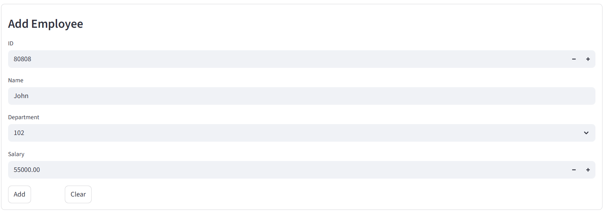
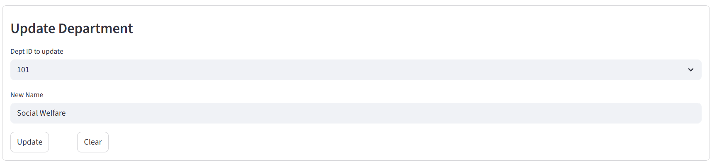
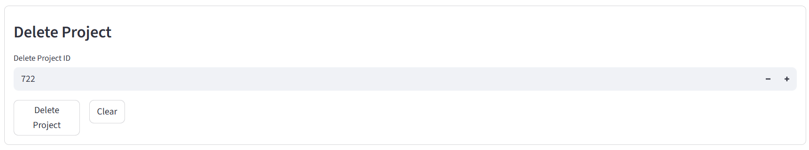

# 🤖 SmartQueryBot – AI SQL Chatbot with CRUD & Analytics

SmartQueryBot is a Streamlit-based application that empowers users to manage and query an employee database using natural language. Powered by LangChain and LLaMA 3.1 (via Ollama), the app supports full CRUD functionality across Employees, Departments, and Projects, alongside dynamic chart visualizations.

---

## 🚀 Features

- 🧠 **AI Chatbot** – Ask natural language questions; get accurate SQL-powered answers.
- 🧑‍💼 **Employee Management** – Add, update, and delete employee data easily.
- 🏢 **Department CRUD** – Manage department records with form-based inputs.
- 📁 **Project Handling** – Assign and update projects under specific departments.
- 📊 **Chart Reports** – Visualize data using interactive and selectable charts.
- 🔄 **Clear Buttons** – Reset input forms on every tab with a click.
- ⚙️ **Modular Tabs** – Organized UI with dedicated sections for each module.

---

## 🛠️ Tech Stack

- **Frontend**: Streamlit
- **LLM Engine**: LLaMA 3.1 via Ollama
- **Framework**: LangChain
- **Database**: SQLite
- **Language**: Python 3.10+

---

## 📦 Installation

```bash
# Clone the repository
git clone https://github.com/kalaiselvimurugan/AI-Chatbots-for-Database-Retrieval.git
cd SmartQueryBot

# Create virtual environment
python -m venv venv
source venv/bin/activate        # For Linux/Mac
venv\Scripts\activate         # For Windows

# Install dependencies
pip install -r requirements.txt

# Ensure Ollama is running with LLaMA 3.1
ollama run llama3.1

# Launch the Streamlit app
streamlit run app.py
```

---

## 🧠 Sample Prompts

```markdown
FOR CHATBOT:
- "List all employees working in the HR department"
- "Add a new employee John Doe to department 2 with salary 45000"
- "Update project name to 'AI Migration' for project ID 3"
- "Delete employee with ID 105"
- "Show total salary per department"

FOR CHARTS:
- X-axis:employee_name, Y-axis:salary, chart type:Bar 
- X-axis:project_id, Y-axis:budget, chart type:Scatter
```

**Note:**
Pie Charts, the X-axis column should be categorical (like names), and the Y-axis should be numeric (like salary or budget).
Avoid using columns with lots of nulls or unrelated types (e.g., employee_id vs department_name).

---

## ✍️ CRUD Form Sample

```python
col1, col2 = st.columns(2)
with col1:
    st.form_submit_button("Add")
with col2:
    st.form_submit_button("Clear")
```

The above layout is used across all tabs: Employees, Departments, and Projects for better UX.

---

## 📸 Screenshots

- ✅ Chatbot answering questions
 
- ✅ Employee CRUD in action
   
- ✅ Department and Project Forms
   
   
- ✅ Dynamic chart selection


---

## 🔧 Requirements

```
sqlite3
streamlit
langchain
Ollama
pandas
matplotlib
ChatPromptTemplate
```
---
